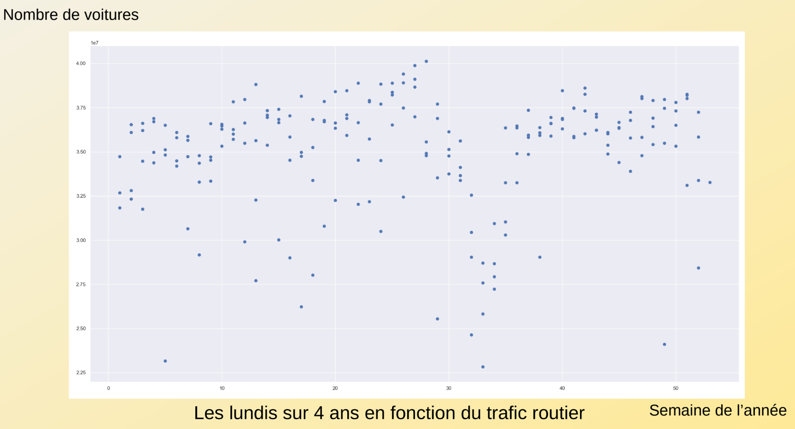
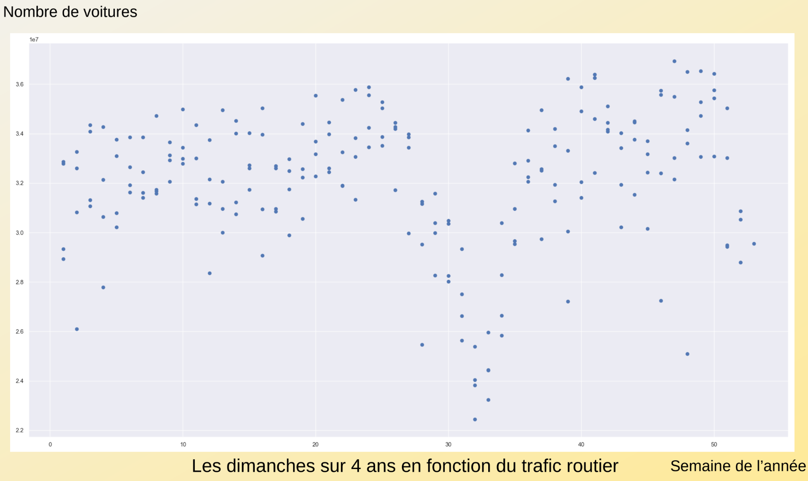
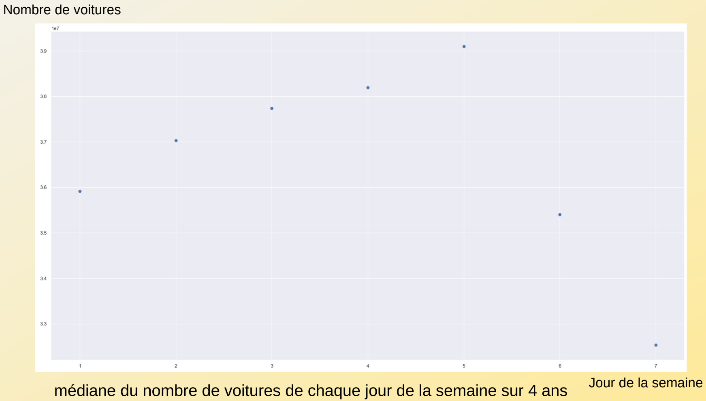
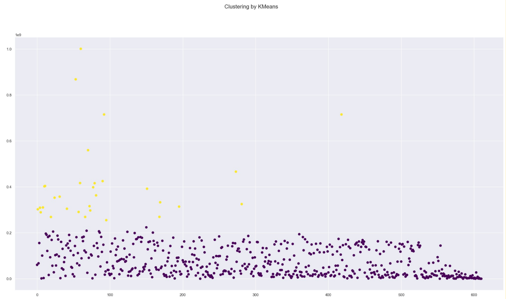

# Parisian Road Traffic and Air Pollution Analysis


This project analyzes the relationship between road traffic density and air pollution in Paris. Using a large 4-year dataset of traffic sensor data, it implements a complete data pipeline from raw data processing to geospatial visualization. The core of the project involves using K-Means clustering to segment Parisian streets into high and low traffic categories and then generating an interactive map to visualize these hotspots.

## Key Features

-   **Large-Scale Data Processing:** Manages and analyzes a 25 GB dataset of traffic data from the city of Paris.
-   **Unsupervised Learning:** Implements K-Means clustering with Scikit-learn to automatically classify streets based on their 4-year average traffic volume.
-   **Geospatial Visualization:** Uses Geopy, OSMnx, and Folium to convert street names into coordinates and generate a dynamic, interactive map of traffic density.
-   **End-to-End Pipeline:** A complete workflow from cleaning and aggregating raw data in SQLite to producing the final visualization.

## Tech Stack

-   **Languages:** Python, SQL
-   **Libraries:**
    -   Data Manipulation: `Pandas`, `NumPy`
    -   Database: `sqlite3`
    -   Machine Learning: `Scikit-learn`
    -   Geospatial: `Folium`, `Geopy`, `OSMnx`
    -   Visualization: `Matplotlib`

## Data Source

The primary dataset used in this project is the **"Comptage routier - Historique données trafic issues des capteurs permanents"** provided by the Mairie de Paris on the French open data portal.

-   **Link:** [data.gouv.fr](https://www.data.gouv.fr/fr/datasets/comptage-routier-historique-donnees-trafic-issues-des-capteurs-permanents-1/)
-   **Size:** ~25 GB
-   **Period:** 2014-01-01 to 2018-01-01

**Note:** Due to its size, the raw CSV file is not included in this repository. The scripts are designed to work with an intermediate SQLite database (`tableur.db`) created from this raw data for more efficient processing.

## Methodology

The project is divided into two main parts, corresponding to the two Python scripts.

### Part 1: Exploratory Data Analysis (`Program_first_part.py`)

This script focuses on initial data exploration and time-series analysis.
1.  **Data Aggregation:** The script processes the raw data to calculate the total daily traffic volume across Paris for the entire 4-year period.
2.  **Time-Series Analysis:** It then segments this data by day of the week to analyze traffic patterns (e.g., comparing traffic on Mondays vs. Sundays).
3.  **Visualization:** Matplotlib is used to generate scatter plots showing traffic volume over the weeks of the year, revealing seasonal trends and holiday impacts.

### Part 2: Clustering and Map Generation (`Program_second_part.py`)

This script contains the core machine learning and visualization pipeline.
1.  **Data Aggregation per Street:** The script first calculates the total vehicle count for each unique street over the 4-year period. Street names are cleaned to handle inconsistencies.
2.  **Clustering with K-Means:** `scikit-learn`'s `KMeans` algorithm is used to partition the streets into two clusters: high-traffic and low-traffic.
3.  **Geocoding:** The names of the high-traffic streets are converted into GPS coordinates using the `Geopy` library with the Nominatim API. A custom error-handling function (`correction_libelle`) is implemented to improve geocoding success rates.
4.  **Interactive Map Generation:**
    -   `OSMnx` is first used to download the entire street network of Paris.
    -   `Folium` plots this base network on an interactive map, with all streets colored in blue.
    -   The script then iterates through the geocoded high-traffic streets, using `OSMnx` again to fetch the specific geometry of each street and overlaying it in red on the map.

## Results & Visualizations

### Final Traffic Map

The primary output of the project is an interactive HTML map (`Final_Paris_Map.html`) that visualizes the most congested streets in Paris. High-traffic streets, as identified by the K-Means algorithm, are highlighted in red, while the rest of the network is shown in blue.


*Figure 1: Final map showing high-traffic streets (red) overlaid on the Parisian road network (blue).*

### Exploratory Analysis and Clustering Results

The initial analysis revealed interesting patterns in traffic data, and the clustering step effectively segmented the streets.

<table>
  <tr>
    <td align="center" colspan="2"><strong>Weekly Traffic Patterns over 4 Years</strong></td>
  </tr>
  <tr>
    <td align="center"><strong>Mondays</strong></td>
    <td align="center"><strong>Sundays</strong></td>
  </tr>
  <tr>
    <td></td>
    <td></td>
  </tr>
  <tr>
    <td colspan="2" align="center"><em>Figure 2: Comparison of daily traffic volumes, highlighting the significant difference between a weekday (Monday) and a weekend day (Sunday).</em></td>
  </tr>
  <tr>
    <td align="center"><strong>Median Weekly Traffic over 4 Years</strong></td>
    <td align="center"><strong>Raw Data vs. K-Means Clustering</strong></td>
  </tr>
  <tr>
    <td></td>
    <td></td>
  </tr>
  <tr>
    <td align="center"><em>Figure 3: Median traffic volume for each week of the year, showing seasonal variations.</em></td>
    <td align="center"><em>Figure 4: Scatter plot of streets by ID and traffic volume, colored by their assigned K-Means cluster.</em></td>
  </tr>
    <tr>
    <td align="center" colspan="2"><strong>Clustering Algorithm Comparison</strong></td>
  </tr>
    <tr>
    <td colspan="2" align="center"></td>
  </tr>
    <tr>
    <td colspan="2" align="center"><em>Figure 5: An exploration of various clustering algorithms on different data structures, justifying the choice of K-Means for this problem.</em></td>
  </tr>
</table>

## How to Run

1.  **Dependencies:** Make sure you have all the required Python libraries installed.
    ```bash
    pip install pandas numpy matplotlib scikit-learn folium geopy osmnx networkx
    ```
2.  **Data Setup:**
    -   Download the raw dataset from the [source](https://www.data.gouv.fr/fr/datasets/comptage-routier-historique-donnees-trafic-issues-des-capteurs-permanents-1/).
    -   Create an SQLite database named `tableur.db` and import the CSV data into a table named `tabdonnées`.
    -   Update the file paths in the scripts to point to your database location.

3.  **Execution:** (Warning: these programs are not optimal; calculation times may take several hours.)
    -   Run `Program_first_part.py` to generate the exploratory data analysis plots. Note that this script saves intermediate results (`liste_jours.py`) to avoid lengthy recalculations.
    -   Run `Program_second_part.py` to perform the clustering and generate the final HTML map. This script also saves intermediate results (`Valeur VR4.py`, `id_lib.py`) for efficiency. The final map will be saved as `Final_Paris_Map.html`.
